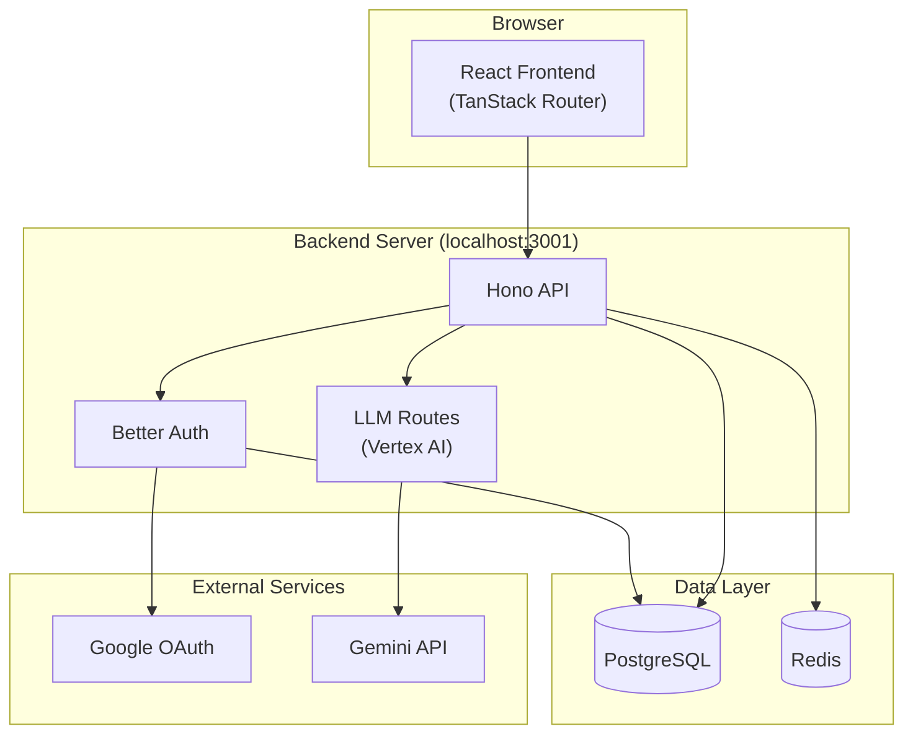

# Campaign Oracle

Campaign Oracle is a GM-facing campaign management app with a React frontend and a TypeScript API.

## Structure

| Package | Technology | Purpose |
|---------|------------|---------|
| `apps/web` | React + TanStack Router + Vite | Frontend SPA |
| `apps/api` | Hono + Drizzle ORM + PostgreSQL | Backend API |
| `packages/shared` | TypeScript | Shared types & utilities |

---

## Frontend

| Directory | Purpose |
|-----------|---------|
| `app/routes/` | TanStack Router file-based routes (`index.tsx`, `party.tsx`, `quests.tsx`, etc.) |
| `app/hooks/` | Data fetching hooks (`useCampaignData`, `useCampaigns`, `useSearch`) |
| `app/lib/` | Hono RPC client (`client.ts`), Better Auth client (`auth-client.ts`) |
| `app/components/layout/` | `Sidebar`, `Header`, `OraclePanel` |
| `components/views/` | Page-level components (`DashboardView`, `PartyView`, `QuestsView`, etc.) |
| `components/ui/` | Reusable UI primitives (`Button`, `Card`, `Badge`, `StatCard`) |
| `contexts/` | React contexts (`AuthContext`, `NotificationContext`) |

---

## Backend

| Directory | Purpose |
|-----------|---------|
| `src/routes/` | API route handlers (`campaigns.ts`, `characters.ts`, `quests.ts`, `llm.ts`, `items.ts`) |
| `src/db/` | Drizzle schema (`schema.ts`), migrations, seed scripts |
| `src/middleware/` | Auth middleware (`auth.ts`), rate limiting |
| `src/lib/` | Better Auth setup (`auth.ts`) |
| `src/index.ts` | Hono app entry point, mounts all routes |

---

## Highlights

- **Frontend**: React 19, TanStack Router, TanStack Query, Tailwind CSS
- **Backend**: Hono, Drizzle ORM, Better Auth, Zod
- **Database**: PostgreSQL, Redis
- **AI**: Vertex AI (Gemini) for chat and session analysis

## Included Docs

- `docs/QUICKSTART.md`
- `docs/FRONTEND_GUIDE.md`
- `docs/API_REFERENCE.md`
- `docs/DATABASE_SCHEMA.md`
