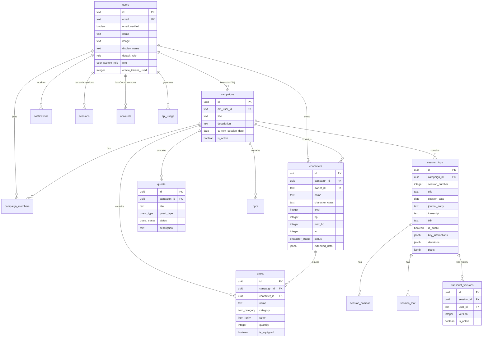

# Campaign Oracle Database Schema

PostgreSQL database schema using Drizzle ORM.

## Entity Relationship Diagram



---

## Enums

| Enum | Values |
|------|--------|
| `role` | `dm`, `player`, `spectator` |
| `user_system_role` | `guest`, `player`, `dm`, `admin` |
| `quest_type` | `Main`, `Side`, `Rumor` |
| `quest_status` | `active`, `completed`, `failed` |
| `notification_type` | `info`, `success`, `warning`, `ai` |
| `character_status` | `active`, `inactive`, `deceased` |
| `item_rarity` | `common`, `uncommon`, `rare`, `very_rare`, `legendary`, `artifact` |
| `item_category` | `weapon`, `armor`, `consumable`, `wondrous`, `treasure`, `misc` |

---

## Tables

### users

Better Auth managed table with custom extensions.

| Column | Type | Description |
|--------|------|-------------|
| `id` | text PK | Better Auth generated ID |
| `email` | text UK | User email (unique) |
| `email_verified` | boolean | Email verification status |
| `name` | text | Display name from OAuth |
| `image` | text | Avatar URL from OAuth |
| `display_name` | text | Custom display name |
| `default_role` | role enum | Default campaign role |
| `avatar_url` | text | Custom avatar URL |
| `invite_code` | text | Used invite code (auditing) |
| `role` | user_system_role | System-wide role |
| `oracle_tokens_used` | integer | Monthly AI token usage |
| `oracle_tokens_reset_at` | timestamp | Token reset date |
| `api_requests_today` | integer | Daily API request count |
| `api_requests_reset_at` | timestamp | Request count reset date |

### sessions (Auth)

Better Auth session table.

| Column | Type | Description |
|--------|------|-------------|
| `id` | text PK | Session ID |
| `user_id` | text FK | User reference |
| `token` | text UK | Session token |
| `expires_at` | timestamp | Expiration time |
| `ip_address` | text | Client IP |
| `user_agent` | text | Client user agent |

### accounts

OAuth provider accounts (Better Auth).

| Column | Type | Description |
|--------|------|-------------|
| `id` | text PK | Account ID |
| `user_id` | text FK | User reference |
| `provider_id` | text | OAuth provider (google, github) |
| `account_id` | text | Provider account ID |
| `access_token` | text | OAuth access token |
| `refresh_token` | text | OAuth refresh token |

### campaigns

D&D campaigns owned by DMs.

| Column | Type | Description |
|--------|------|-------------|
| `id` | uuid PK | Campaign ID |
| `dm_user_id` | text FK | DM user reference |
| `title` | text | Campaign name |
| `description` | text | Campaign description |
| `current_session_date` | date | Current in-game date |
| `is_active` | boolean | Active status |

### campaign_members

Campaign membership (players, spectators).

| Column | Type | Description |
|--------|------|-------------|
| `id` | uuid PK | Membership ID |
| `campaign_id` | uuid FK | Campaign reference |
| `user_id` | text FK | User reference |
| `role` | role enum | Member role (dm/player/spectator) |
| `joined_at` | timestamp | Join date |

**Indexes**: `campaign_id`, `user_id`

### characters

Player characters in campaigns.

| Column | Type | Description |
|--------|------|-------------|
| `id` | uuid PK | Character ID |
| `campaign_id` | uuid FK | Campaign reference |
| `owner_id` | text FK | Owner user reference |
| `name` | text | Character name |
| `player_name` | text | Player name |
| `character_class` | text | D&D class |
| `subclass` | text | D&D subclass |
| `level` | integer | Character level (default: 1) |
| `race` | text | D&D race |
| `hp`, `max_hp`, `temp_hp` | integer | Hit points |
| `ac` | integer | Armor class (default: 10) |
| `strength`...`charisma` | integer | Ability scores (default: 10) |
| `status` | character_status | active/inactive/deceased |
| `extended_data` | jsonb | Skills, spells, inventory, etc. |

**Indexes**: `campaign_id`, `owner_id`

### quests

Campaign quests and rumors.

| Column | Type | Description |
|--------|------|-------------|
| `id` | uuid PK | Quest ID |
| `campaign_id` | uuid FK | Campaign reference |
| `quest_type` | quest_type enum | Main/Side/Rumor |
| `title` | text | Quest title |
| `source` | text | Quest giver |
| `description` | text | Quest details |
| `outcome` | text | Quest resolution |
| `status` | quest_status | active/completed/failed |

**Indexes**: `campaign_id`

### npcs

Non-player characters.

| Column | Type | Description |
|--------|------|-------------|
| `id` | uuid PK | NPC ID |
| `campaign_id` | uuid FK | Campaign reference |
| `name` | text | NPC name |
| `location` | text | NPC location |
| `notes` | text | DM notes |
| `image_url` | text | NPC portrait |
| `is_active` | boolean | Active status |

### session_logs

Session journal entries.

| Column | Type | Description |
|--------|------|-------------|
| `id` | uuid PK | Session ID |
| `campaign_id` | uuid FK | Campaign reference |
| `session_number` | integer | Session number |
| `title` | text | Session title |
| `session_date` | date | Real-world date |
| `location` | text | Primary location |
| `tldr` | text | Auto-generated summary (2-4 sentences) |
| `journal_entry` | text | Narrative summary |
| `key_interactions` | jsonb | Array of npc/description objects |
| `decisions` | jsonb | Array of description/resolved objects |
| `plans` | jsonb | Array of description/completed objects |
| `transcript` | text | Session transcript |
| `audio_url` | text | Audio recording URL |
| `is_public` | boolean | Public visibility (Chronicle) |

### transcript_versions

AI-refined transcript history.

| Column | Type | Description |
|--------|------|-------------|
| `id` | uuid PK | Version ID |
| `session_id` | uuid FK | Session reference |
| `user_id` | text FK | User who requested refinement |
| `version` | integer | Version number |
| `content` | text | Transcript content |
| `ai_instructions` | text | Analysis/refinement prompts |
| `is_active` | boolean | Currently displayed version |
| `is_ai_generated` | boolean | Created by AI |

### session_combat

Combat encounters per session.

| Column | Type | Description |
|--------|------|-------------|
| `id` | uuid PK | Combat ID |
| `session_id` | uuid FK | Session reference |
| `enemy_name` | text | Enemy name |
| `result` | text | Combat outcome |

### session_loot

Loot acquired per session.

| Column | Type | Description |
|--------|------|-------------|
| `id` | uuid PK | Loot ID |
| `session_id` | uuid FK | Session reference |
| `item_name` | text | Item name |
| `effect` | text | Item effect |

### items

Campaign inventory.

| Column | Type | Description |
|--------|------|-------------|
| `id` | uuid PK | Item ID |
| `campaign_id` | uuid FK | Campaign reference |
| `character_id` | uuid FK | Owner character (nullable) |
| `name` | text | Item name |
| `description` | text | Item description |
| `category` | item_category | weapon/armor/etc. |
| `rarity` | item_rarity | common to artifact |
| `quantity` | integer | Stack count |
| `is_equipped` | boolean | Equipped status |
| `notes` | text | DM notes |
| `image_url` | text | Item image |

**Indexes**: `campaign_id`, `character_id`

### notifications

User notifications.

| Column | Type | Description |
|--------|------|-------------|
| `id` | uuid PK | Notification ID |
| `user_id` | text FK | User reference |
| `title` | text | Notification title |
| `message` | text | Notification content |
| `notification_type` | notification_type | info/success/warning/ai |
| `is_read` | boolean | Read status |

### api_usage

API usage tracking for rate limiting and observability.

| Column | Type | Description |
|--------|------|-------------|
| `id` | uuid PK | Usage ID |
| `user_id` | text FK | User reference (nullable) |
| `endpoint` | text | API endpoint |
| `method` | text | HTTP method |
| `status_code` | integer | Response status |
| `response_time_ms` | integer | Response time |
| `tokens_used` | integer | LLM tokens consumed |
| `request_ip` | text | Client IP |
| `error_message` | text | Error details |

**Indexes**: `user_id`, `endpoint`, `created_at`

---

## Migrations

Migrations are managed via Drizzle Kit:

```bash
# Generate migration from schema changes
pnpm drizzle-kit generate

# Apply migrations
pnpm drizzle-kit push

# Open Drizzle Studio
pnpm drizzle-kit studio
```

Migration files: `apps/api/src/db/migrations/`
